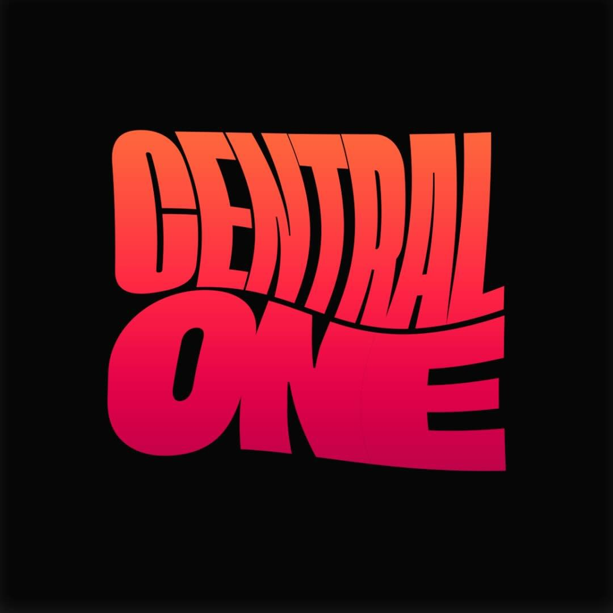

# Central One - Sistema de Gestão

  

## 📋 Sobre

Central One é um sistema de gestão desenvolvido para gerenciar membros, visitantes e presenças de forma eficiente e intuitiva.

## ✨ Funcionalidades

- 👥 **Gestão de Membros e Visitantes**

  - Cadastro completo com informações pessoais
  - Upload de fotos
  - Verificação de duplicatas
  - Histórico de visitas

- 📊 **Dashboard**

  - Métricas em tempo real
  - Gráficos de crescimento
  - Distribuição por ministérios

- ✅ **Controle de Presenças**

  - Registro rápido de presenças
  - Histórico por pessoa
  - Busca integrada

- 🎂 **Aniversariantes**
  - Lista mensal
  - Notificações automáticas
  - Filtros personalizados

## 🛠️ Tecnologias

- [React](https://reactjs.org/)
- [TypeScript](https://www.typescriptlang.org/)
- [Vite](https://vitejs.dev/)
- [Tailwind CSS](https://tailwindcss.com/)
- [shadcn/ui](https://ui.shadcn.com/)
- [Firebase](https://firebase.google.com/)
- [React Router](https://reactrouter.com/)
- [Lucide Icons](https://lucide.dev/)

## 📱 Layout Responsivo

O sistema é totalmente responsivo, adaptando-se a diferentes tamanhos de tela:

- 💻 Desktop
- 📱 Tablet
- 📱 Mobile

## 🌙 Tema Dark/Light

Suporte a tema claro e escuro com persistência da preferência do usuário.

## 🤝 Contribuindo

Contribuições são sempre bem-vindas! Sinta-se à vontade para:

1. Reportar bugs
2. Sugerir novas funcionalidades
3. Enviar pull requests

## 📄 Licença

Este projeto está sob a licença MIT. Veja o arquivo [LICENSE](LICENSE) para mais detalhes.

## 👨‍💻 Autor

Desenvolvido por [Vinicius Graciano](https://github.com/viniciuswx)

---

  Feito com ❤️ para Central One.

